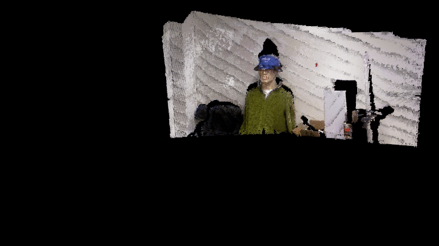

# Implementation of Kinect Fusion

This repository is about an implementation of [Kinect Fusion](https://ieeexplore.ieee.org/document/6162880) algorithms. Here the image capturing part in real-time is not included. Instead, a sequence of pre-captured images is used as input for the system. After executing the program, the system will estimate each frame's camera pose and predict 3D surface points based on the signed distance value and the ray casting technique. As such, with more and more frames being processed, the predicted 3D points are gradually aggregated in the global coordinate and an indoor environment can then be reconstructed.

## Dependencies for Running Locally (Linux)

* cmake >= 2.8
  * [click here for installation instructions](https://cmake.org/install/)
* make >= 4.1
  * Linux: make is installed by default on most Linux distros
* OpenCV >= 4.1
  * The OpenCV 4.1.0 source code can be found [here](https://github.com/opencv/opencv/tree/4.1.0)
* gcc/g++ >= 5.4
  * Linux: gcc / g++ is installed by default on most Linux distros
* CUDA >= 11.0
  * Download CUDA [here](https://developer.nvidia.com/cuda-downloads/)
* PCL >= 1.2
  * Download PCL [here](https://pointclouds.org/downloads/)

## Basic Build Instructions

1. Clone this repo: `https://github.com/PoChang007/Kinect_Fusion_SLAM.git`
2. `cd Kinect_Fusion_SLAM`
3. `mkdir build && cd build`
4. Compile: `cmake .. && make -j4`
5. Run it: `./kinfu_imp`

## File Structure

* `src/` contains all `*.cpp` and `*.cu` files
* `data/` contains the RGB-D images of a static background scanning

| Class Name      | Description                               |
|-----------------|-------------------------------------------|
| KinfuPipeline   | Where camera intrinsic parameters and a voxel grid for TSDF are initialized. Parallel processing tasks fo each frame are called here |
| SystemUtility   | For image processings and storages of raw 3D data and predicted 3D points |
| ThreeDViewer    | Visualization of 3D point clouds. Each frame's predicted 3D points will be aligned in the global coordinate |

The `system_interface.cpp` is used to get start Kinect fusion system. The aggregated 3D point clouds are rendered in the 3D viewer. More information can be found in [Usage](#Usage).

### Parallel Processing Tasks

| Cuda file              | Description                               |
|------------------------|-------------------------------------------|
| projective_tsdf        | Each voxel's tsdf is updated based on the voxel's projection onto the current frame's depth |
| voxel_traversal        | Each ray will traverse the voxel grid to check zero crossing regions. If a zero crossing regions is found, the surface points can be predicted |
| raw_vertices           | Each pixel in the depth image is converted to the 3D point |
| sensor_pose_estimation | Find eligible point pairs between the current frame and the previous frame and use ICP to refine the current frame of camera pose |

## Usage

Once the program is started, the 3D point clouds are rendered in 3D viewer. The current processing frame of color and depth images are displayed in the different windows.

In 3D viewer,

* Press `r` to reset camera viewpoint
* Press `e` to end the program

## Other Information

1. In this repo the RGB-D data is captured by Kinect v1. It is workable for other RGB-D sensors as long as the image size, camera's extrinsics and extrinsics between color/depth cameras are known
1. When the current frame's processing is done, its corresponding camera pose is temporarily stored in `cv::Mat Kinfu::KinfuPipeline::extrinsic_matrix` until the processing of the next frame is finished
1. By default 3D point clouds are drawn per 5th frame
1. The system was originally implemented in Matlab. The voxel traversal algorithm for ray uses Matlab index style (start at 1)

## License

The project is released under the [MIT License](LICENSE.md).